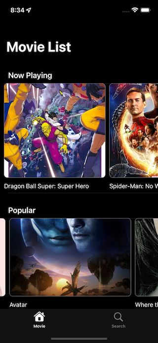

# MovieApp (In-Progress)

Show listing of movies and search features (MVVM Architecture)
1. Async Await API 
2. Combine 
3. Protocol oriented programming 

#### Movies App Screenshots

<table>
  <tr>
    <td>Movie Listing</td>
     <td>Details</td>
  </tr>
  <tr>
    <td></td>
    <td></td>
  </tr>
 </table>
